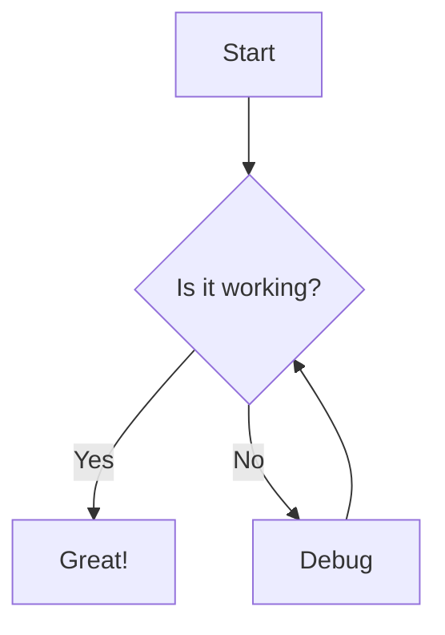
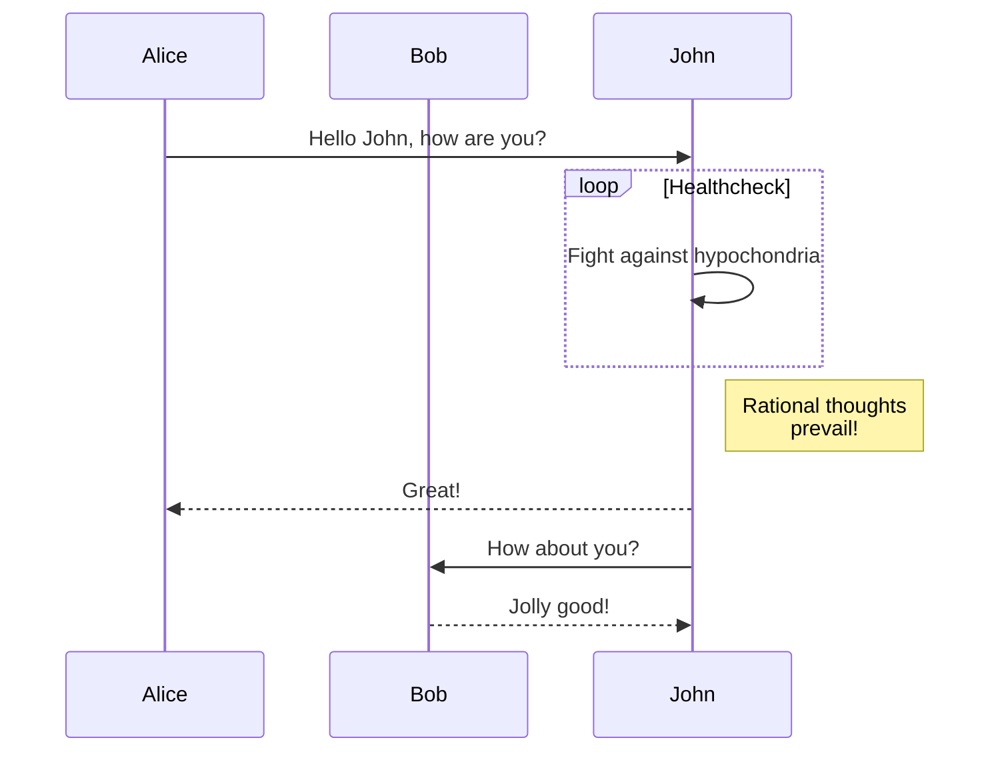
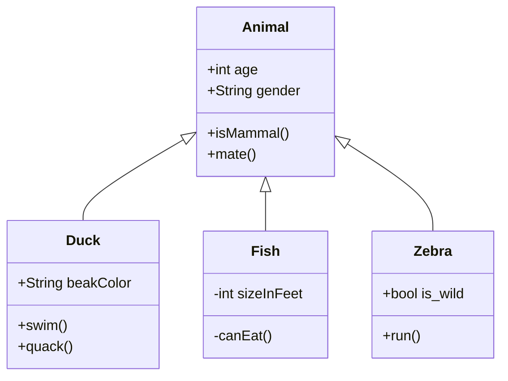

# Sample Markdown Document

This is a demonstration of **MarkdownToRender** capabilities. Here's some *italic* text.

## Code Examples

### JavaScript

```javascript
function greet(name) {
  return `Hello, ${name}!`;
}

console.log(greet('World'));

// ES6 Class Example
class Person {
  constructor(name, age) {
    this.name = name;
    this.age = age;
  }
  
  sayHello() {
    return `Hi, I'm ${this.name} and I'm ${this.age} years old.`;
  }
  
  static createAnonymous() {
    return new Person('Anonymous', 0);
  }
}

const john = new Person('John', 30);
console.log(john.sayHello());
```

### Python

```python
def factorial(n):
    if n == 0 or n == 1:
        return 1
    else:
        return n * factorial(n-1)
        
print(factorial(5))  # Outputs: 120

# Class and decorator example
class DataProcessor:
    def __init__(self, data):
        self.data = data
        
    def process(self):
        return [x * 2 for x in self.data if x > 0]
        
    @staticmethod
    def version():
        return "1.0.0"
        
processor = DataProcessor([1, -5, 3, 0, 7])
print(processor.process())  # Output: [2, 6, 14]
```

### C++

```cpp
#include <iostream>
#include <vector>
#include <algorithm>

int main() {
    std::vector<int> numbers = {5, 2, 8, 1, 9};
    
    // Sort the vector
    std::sort(numbers.begin(), numbers.end());
    
    // Print sorted numbers
    std::cout << "Sorted numbers: ";
    for (int num : numbers) {
        std::cout << num << " ";
    }
    std::cout << std::endl;
    
    // Calculate sum using lambda
    int sum = std::accumulate(numbers.begin(), numbers.end(), 0);
    std::cout << "Sum: " << sum << std::endl;
    
    return 0;
}
```

### Java

```java
import java.util.Arrays;
import java.util.List;
import java.util.stream.Collectors;

public class StreamExample {
    public static void main(String[] args) {
        List<String> names = Arrays.asList("John", "Alice", "Bob", "Charlie", "David");
        
        // Filter names starting with 'A' or 'B'
        List<String> filtered = names.stream()
            .filter(name -> name.startsWith("A") || name.startsWith("B"))
            .collect(Collectors.toList());
            
        System.out.println("Filtered names: " + filtered);
        
        // Transform to uppercase and join with commas
        String result = names.stream()
            .map(String::toUpperCase)
            .collect(Collectors.joining(", "));
            
        System.out.println("Uppercase names: " + result);
    }
}
```

### Go

```go
package main

import (
    "fmt"
    "sync"
)

func worker(id int, jobs <-chan int, results chan<- int, wg *sync.WaitGroup) {
    defer wg.Done()
    for j := range jobs {
        fmt.Printf("Worker %d processing job %d\n", id, j)
        results <- j * 2
    }
}

func main() {
    jobs := make(chan int, 5)
    results := make(chan int, 5)
    
    var wg sync.WaitGroup
    
    // Start workers
    for w := 1; w <= 3; w++ {
        wg.Add(1)
        go worker(w, jobs, results, &wg)
    }
    
    // Send jobs
    for j := 1; j <= 5; j++ {
        jobs <- j
    }
    close(jobs)
    
    // Wait for workers to finish
    wg.Wait()
    close(results)
    
    // Collect results
    for r := range results {
        fmt.Println("Result:", r)
    }
}
```

### SQL

```sql
-- Create a table
CREATE TABLE employees (
    id INT PRIMARY KEY,
    name VARCHAR(100),
    department VARCHAR(50),
    salary DECIMAL(10, 2)
);

-- Insert data
INSERT INTO employees (id, name, department, salary)
VALUES (1, 'John Doe', 'Engineering', 85000.00),
       (2, 'Jane Smith', 'Marketing', 75000.00),
       (3, 'Bob Johnson', 'Engineering', 95000.00);

-- Query with join and grouping
SELECT 
    department,
    COUNT(*) as employee_count,
    AVG(salary) as avg_salary
FROM employees
GROUP BY department
HAVING COUNT(*) > 0
ORDER BY avg_salary DESC;
```

## Math Expressions

Here's Einstein's famous equation: $E = mc^2$

Inline expressions can include fractions like $\frac{1}{2}$ or complex symbols $\sum_{i=1}^{n} i^2 = \frac{n(n+1)(2n+1)}{6}$

And a more complex formula:

$$
\frac{-b \pm \sqrt{b^2 - 4ac}}{2a}
$$

Matrix representation:

$$
A = \begin{pmatrix}
a_{11} & a_{12} & a_{13} \\
a_{21} & a_{22} & a_{23} \\
a_{31} & a_{32} & a_{33}
\end{pmatrix}
$$

Maxwell's Equations:

$$
\begin{aligned}
\nabla \times \vec{\mathbf{B}} -\, \frac1c\, \frac{\partial\vec{\mathbf{E}}}{\partial t} & = \frac{4\pi}{c}\vec{\mathbf{j}} \\
\nabla \cdot \vec{\mathbf{E}} & = 4 \pi \rho \\
\nabla \times \vec{\mathbf{E}}\, +\, \frac1c\, \frac{\partial\vec{\mathbf{B}}}{\partial t} & = \vec{\mathbf{0}} \\
\nabla \cdot \vec{\mathbf{B}} & = 0
\end{aligned}
$$

## Diagrams

### Flowchart



### Sequence Diagram



### Class Diagram



## Lists

### Unordered List
- Item 1
- Item 2
  - Subitem 2.1
  - Subitem 2.2
- Item 3

### Ordered List
1. First item
2. Second item
   1. Subitem 2.1
   2. Subitem 2.2
3. Third item

## Task List

- [x] Create markdown file
- [x] Implement renderer
- [ ] Run the demo
- [ ] Improve features
- [ ] Add more examples

## Blockquotes

> This is a blockquote
> 
> It can span multiple lines

> Nested blockquotes are also possible
>> Like this one

## Table Example

| Feature | Supported | Notes |
|---------|-----------|-------|
| Headers | ✅ | h1-h6 levels |
| Bold/Italic | ✅ | Using **bold** and *italic* |
| Code blocks | ✅ | With syntax highlighting |
| Math | ✅ | Using KaTeX rendering |
| Diagrams | ✅ | Using Mermaid.js |
| Lists | ✅ | Ordered and unordered |
| Task Lists | ✅ | With checkboxes |
| Tables | ✅ | With alignment |
| Blockquotes | ✅ | With nesting | 